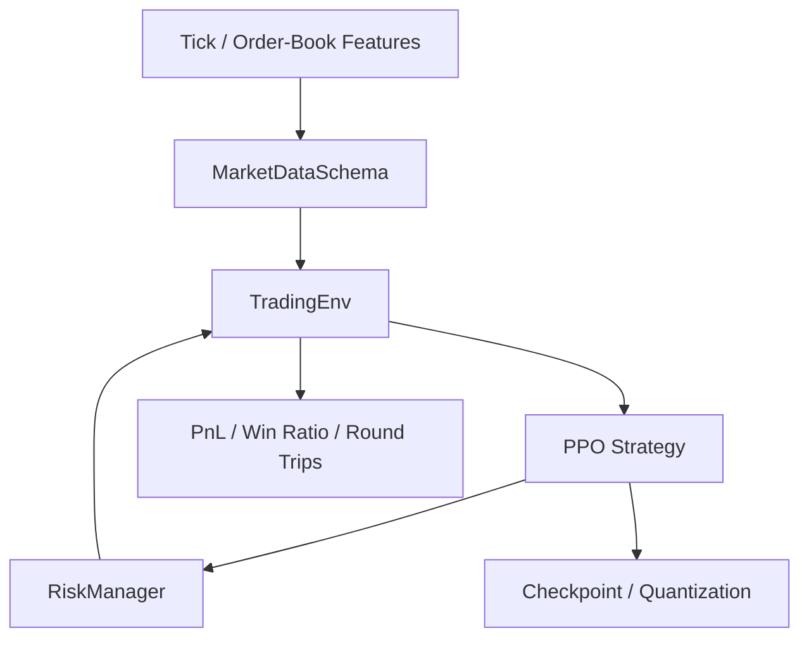

# PPO Trading Strategy

> Reinforcement-learning trading strategy research framework for order-book features, execution-cost modeling, intraday PnL accounting, and risk-controlled PPO training.


## Overview

This project implements a reinforcement-learning trading strategy framework based on **Proximal Policy Optimization (PPO)**. Instead of using a simple OHLC backtest, the environment follows an event-driven market simulation design: actions are executed on bid/ask prices, trading costs are included, positions are bounded, and intraday PnL / round-trip statistics are tracked during training and evaluation.

The repository is structured as a research-to-production style pipeline. Data schema validation, trading environment design, PPO training logic, risk control, evaluation utilities, checkpointing, and quantization hooks are separated into independent modules so each part can be tested or extended without rewriting the whole system.

## Feature Highlights

- Gymnasium-compatible trading environment for daily tick-level episodes.
- Bid/ask execution simulation with handling fee, settlement fee, and transaction tax modeling.
- Actor-critic PPO model with clipped objective, entropy regularization, and gradient clipping.
- Pre-trade risk layer with:
  - max position control
  - max daily loss control
  - drawdown kill switch
  - order-rate throttling
- Strategy evaluation metrics including net profit margin, win ratio, and round-trip trade statistics.
- Feature-store validation through `MarketDataSchema`.
- Post-training quantization hook for deployment-oriented experiments.

## Architecture



## Repository Map

```text
hft_agent/
  env/trading_env.py              # Bid/ask execution environment
  models/actor_critic.py          # Policy/value network
  ppo/ppo_agent.py                # PPO training logic
  risk/risk_manager.py            # Pre-trade risk controls
  utils/market_data_schema.py     # Feature-store validation
  utils/evaluation.py             # Strategy metrics
  quantization/ptq.py             # Post-training quantization hook
scripts/
  train.py
  evaluate.py
config.py                         # Cost, risk, and PPO configuration
main.py                           # CLI entry point
```

## CLI

```bash
python main.py describe
python main.py train --data datasets/order_book_features.parquet --model trained_models/ppo_actor_critic.pth
python main.py evaluate --data datasets/order_book_features.parquet --model trained_models/ppo_actor_critic.pth
```

## Project Positioning

This repository focuses on building a practical reinforcement-learning research workflow for order-book trading strategies. The goal is to connect market microstructure features, execution-cost-aware simulation, PPO-based policy learning, and risk-controlled evaluation in one reproducible framework.
