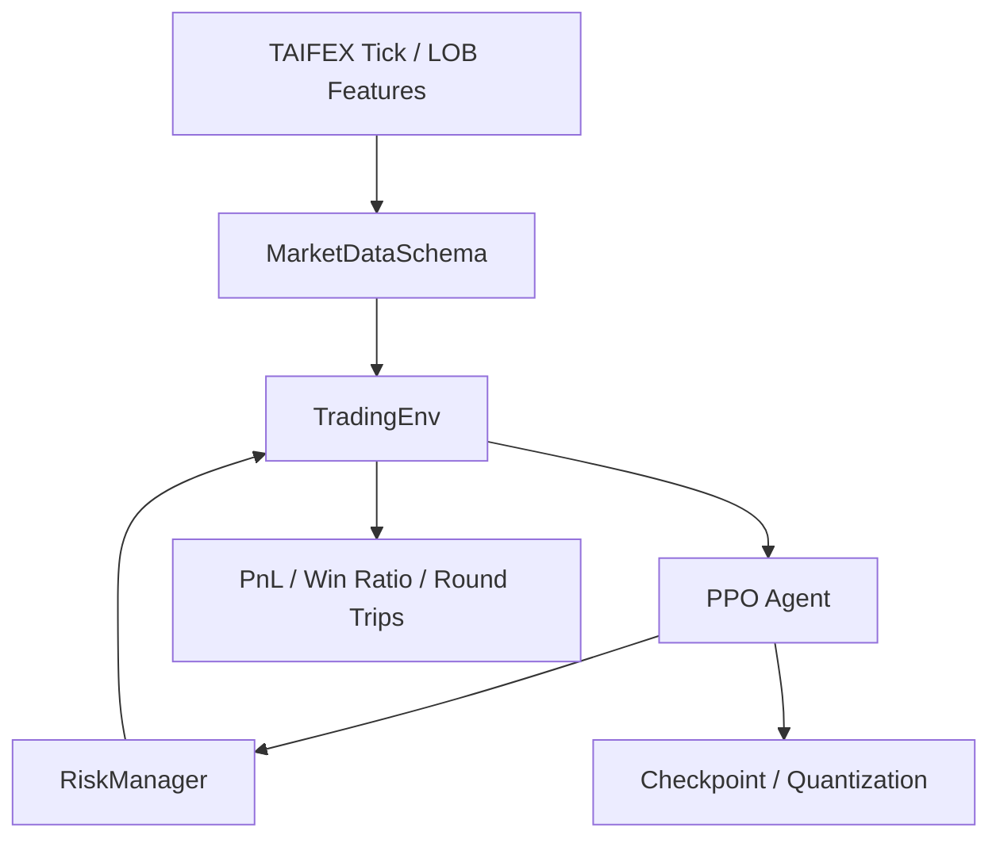

# TAIFEX PPO HFT Agent

> Reinforcement-learning trading research framework for TAIFEX-style order-book features, execution-cost modeling, intraday PnL accounting, and risk-controlled PPO agents.


## Overview

This project implements a high-frequency trading agent around **Proximal Policy Optimization (PPO)**. The environment follows event-driven market simulation assumptions instead of simple OHLC backtests: actions execute on bid/ask, fees and tax are charged, positions are bounded, and daily PnL / round-trip statistics are tracked.

The repo is structured to look like a research-to-production bridge: data schema validation, trading environment, PPO agent, risk manager, evaluation utilities, checkpointing, and quantization hooks are separate modules.

## Feature Highlights

- Gymnasium-compatible trading environment for daily tick episodes.
- Bid/ask execution with handling fee, settlement fee, and transaction tax modeling.
- Actor-critic PPO agent with clipped objective, entropy regularization, and gradient clipping.
- Pre-trade risk layer:
  - max position
  - max daily loss
  - drawdown kill switch
  - order-rate throttling
- Evaluation metrics: net profit margin, win ratio, round-trip trade statistics.
- TAIFEX feature-store validation via `MarketDataSchema`.
- Post-training quantization hook for deployment-oriented experiments.

## Architecture



## Repository Map

```text
hft_agent/
  env/trading_env.py              # Bid/ask execution environment
  models/actor_critic.py          # Policy/value network
  ppo/ppo_agent.py                # PPO training logic
  risk/risk_manager.py            # Pre-trade risk controls
  utils/market_data_schema.py     # Feature-store validation
  utils/evaluation.py             # Strategy metrics
  quantization/ptq.py             # Post-training quantization hook
scripts/
  train.py
  evaluate.py
config.py                         # Cost, risk, and PPO configuration
main.py                           # CLI entry point
```

## CLI

```bash
python main.py describe
python main.py train --data datasets/taifex_lob_features.parquet --model trained_models/ppo_actor_critic_hft.pth
python main.py evaluate --data datasets/taifex_lob_features.parquet --model trained_models/ppo_actor_critic_hft.pth
```
